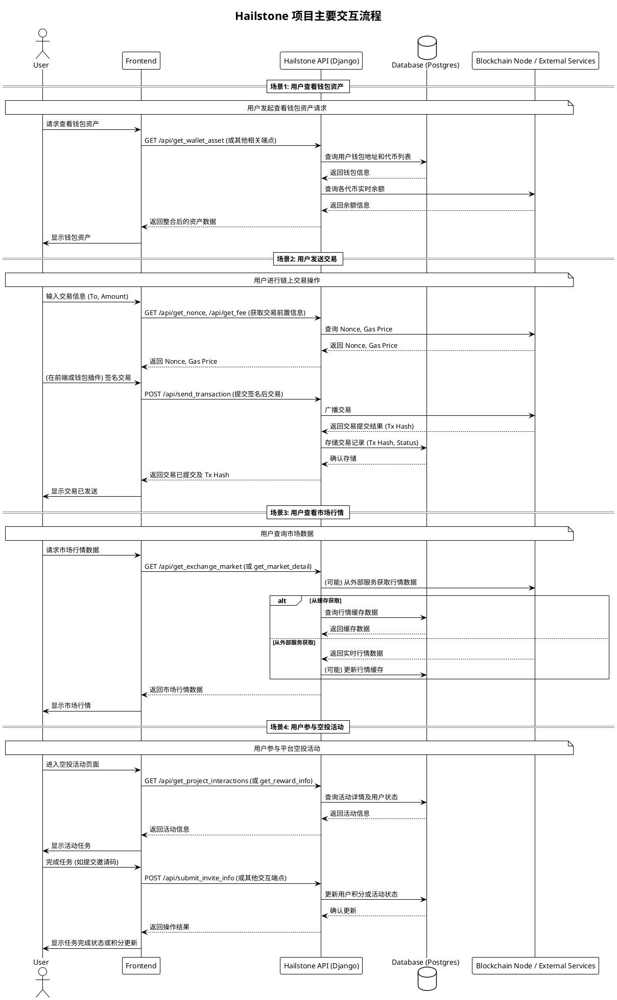

# Hailstone 项目交互流程说明

本文档使用 PlantUML 描述了 Hailstone 项目中几个核心的用户交互流程和系统内部的数据流向。

## 参与者说明

*   **User**: 最终用户，通过前端界面与系统交互。
*   **Frontend**: 用户界面层，可能是 Web 应用或移动应用，负责展示信息和接收用户输入。
*   **Hailstone API (Django)**: 后端核心服务，处理业务逻辑，与数据库和外部服务交互。
*   **Database (Postgres)**: 数据库，用于持久化存储用户信息、钱包数据、交易记录、活动状态等。
*   **Blockchain Node / External Services**: 区块链节点或其他第三方服务，用于查询链上实时数据（如余额、Nonce、Gas费）、广播交易、获取市场行情等。

## 核心交互场景

下面的 PlantUML 图展示了四个典型的交互场景：

1.  **查看钱包资产**: 用户请求查看其钱包内的代币及余额。系统需要从数据库获取用户钱包信息，并可能需要从区块链节点获取实时余额。
2.  **发送交易**: 用户发起一笔链上交易。系统需要先获取链上最新的 Nonce 和 Gas 费用，待用户签名后，将交易广播出去，并记录交易状态。
3.  **查看市场行情**: 用户请求查看加密货币的市场价格信息。系统可能从数据库缓存或外部行情服务获取数据。
4.  **参与空投活动**: 用户参与平台举办的空投活动，完成指定任务以获取积分或奖励。系统需要记录用户的参与状态和积分。

## PlantUML 时序图

